# PlayGamesService

Este é um tutorial de como implementar o Google Play Games Service em um projeto!:
# Tutorial de Implementação do Google Play Games Service

Este é um tutorial passo a passo sobre como implementar o Google Play Games Service em seu projeto.

## Pré-requisitos

Antes de começar, certifique-se de ter:

- Uma conta no Google Cloud Platform (GCP)
- Seu projeto configurado no GCP

## Passos

Siga os passos abaixo para implementar o Google Play Games Service em seu projeto:

1. **Criar um Projeto no Google Cloud Platform (GCP)**:
   - Acesse o Console do GCP em [https://console.cloud.google.com/](https://console.cloud.google.com/)
   - Crie um novo projeto e anote o ID do projeto.

- Descrição da Imagem 2: Aqui está uma representação visual de ...

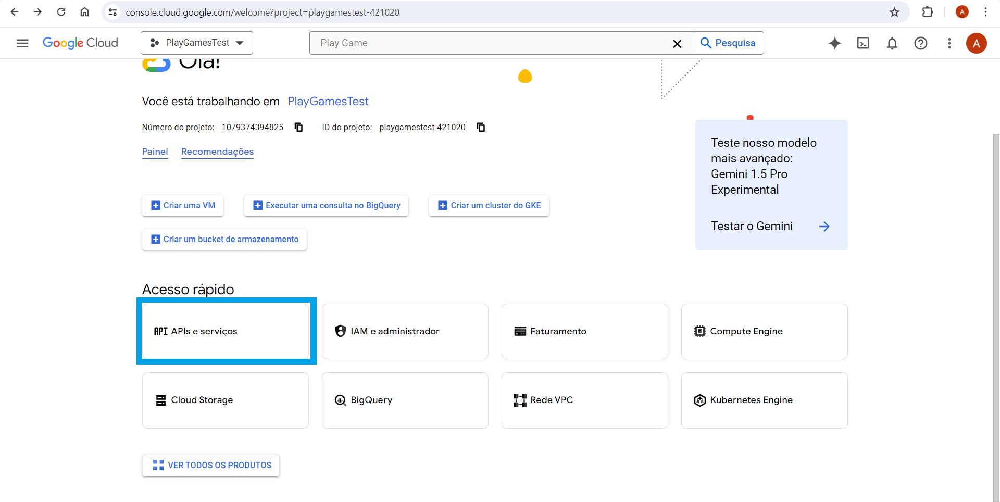

- Descrição da Imagem 3: Nesta imagem, podemos ver ...

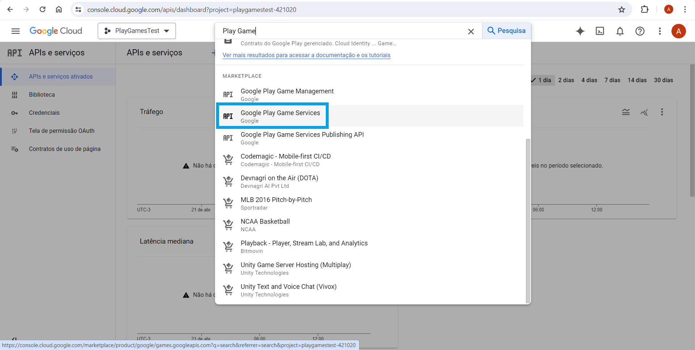

- Descrição da Imagem 4: Esta imagem ilustra ...

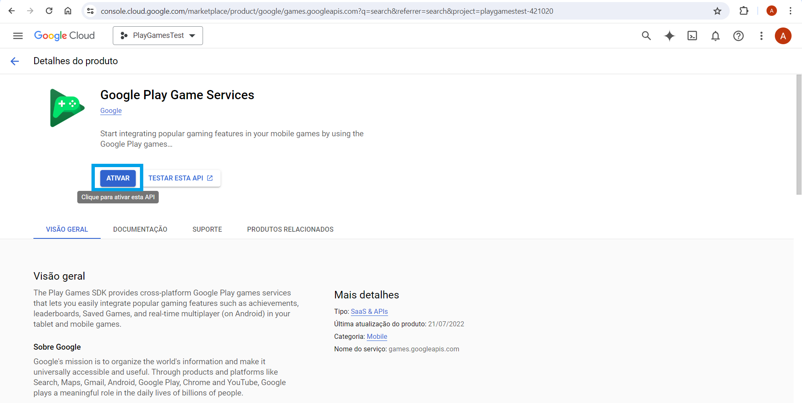

5. 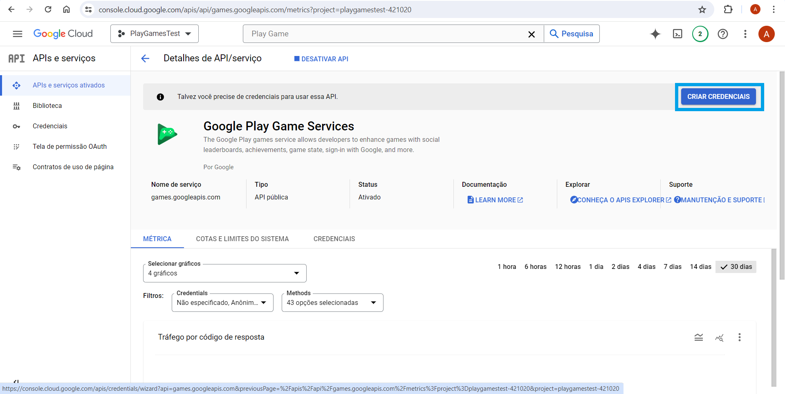
   - Descrição da Imagem 5: Nesta imagem, é mostrado ...

6. 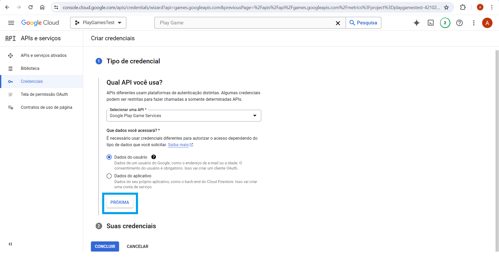
   - Descrição da Imagem 6: Aqui está uma captura de tela de ...

7. 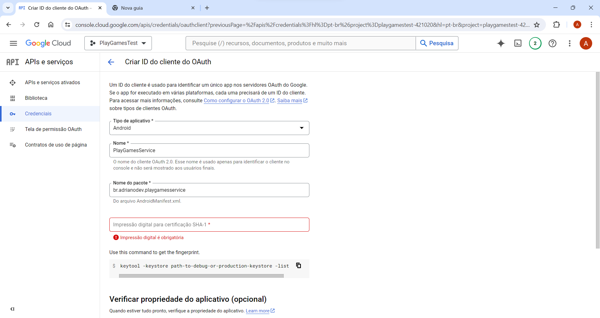
   - Descrição da Imagem 7: Esta imagem destaca ...

8. 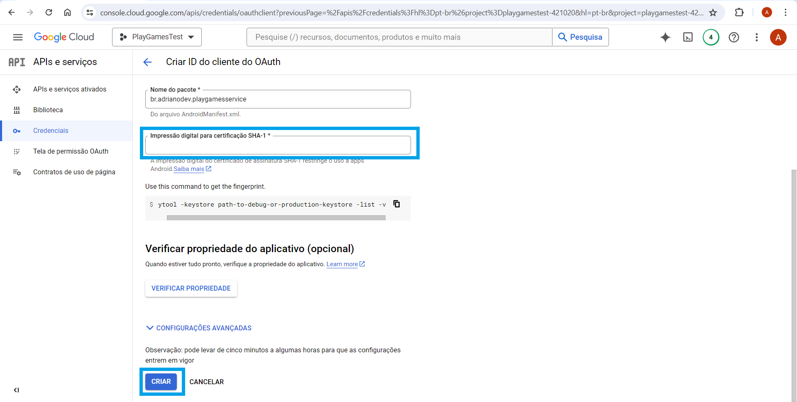
   - Descrição da Imagem 8: Nesta imagem, podemos ver ...

9. 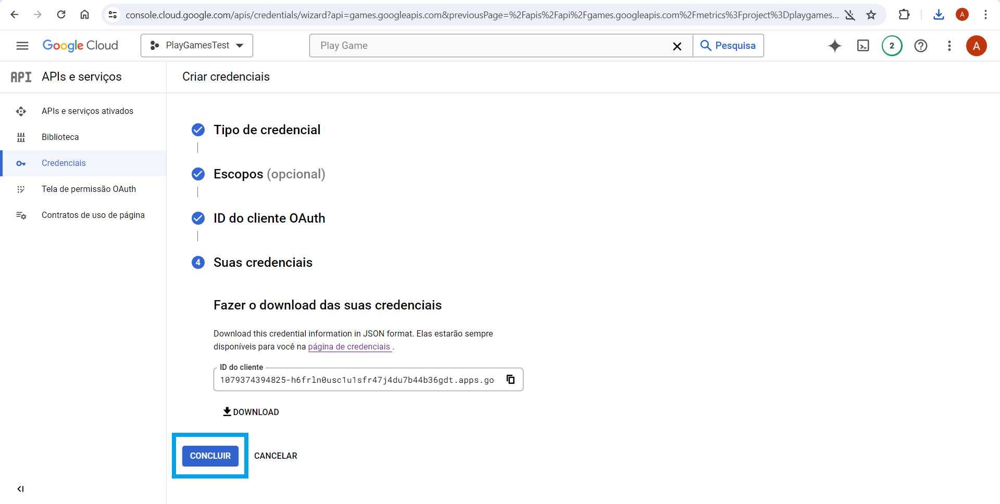
   - Descrição da Imagem 9: Aqui está uma ilustração de ...

10. 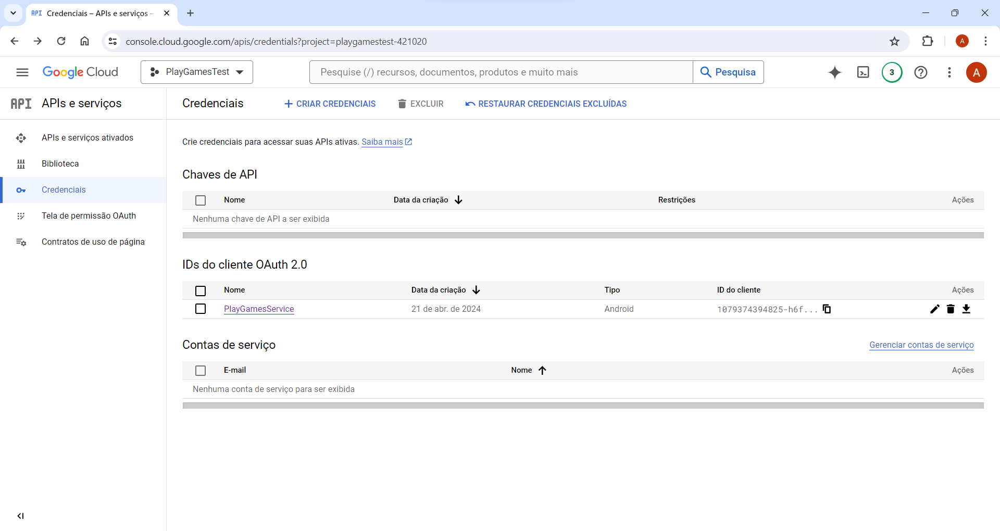
    - Descrição da Imagem 10: Esta imagem mostra ...

11. 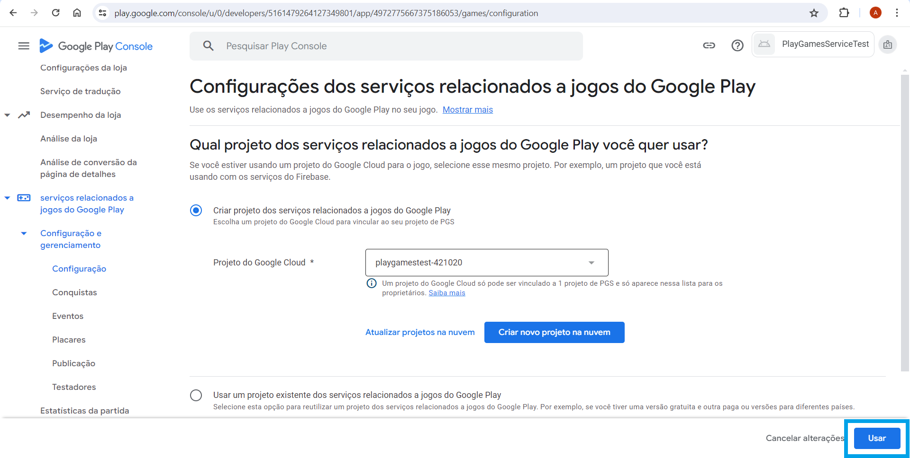
    - Descrição da Imagem 11: Nesta imagem, é destacado ...

12. 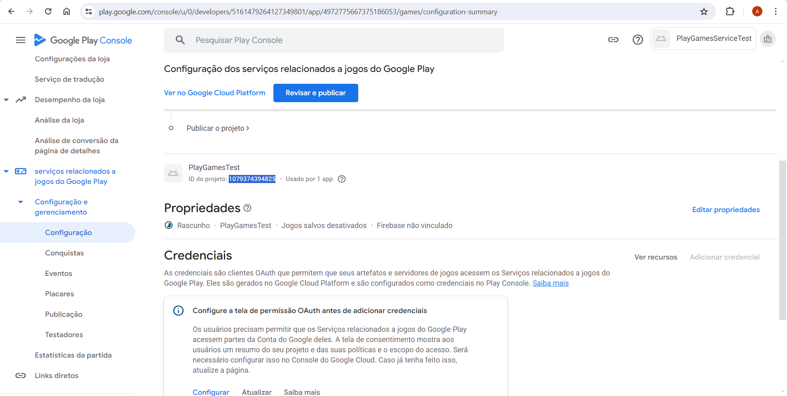
    - Descrição da Imagem 12: Aqui está uma representação visual de ...

13. 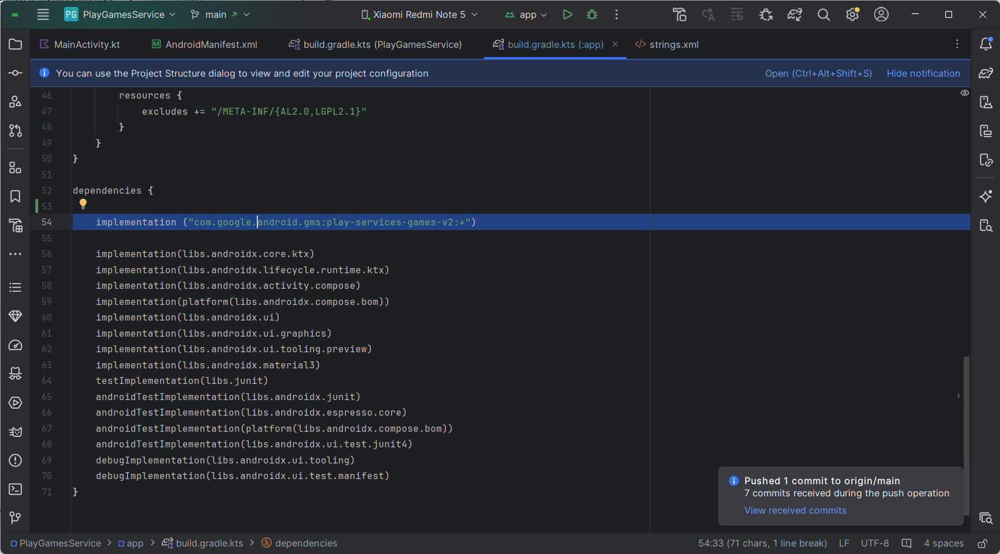
    - Descrição da Imagem 13: Esta imagem captura ...

14. 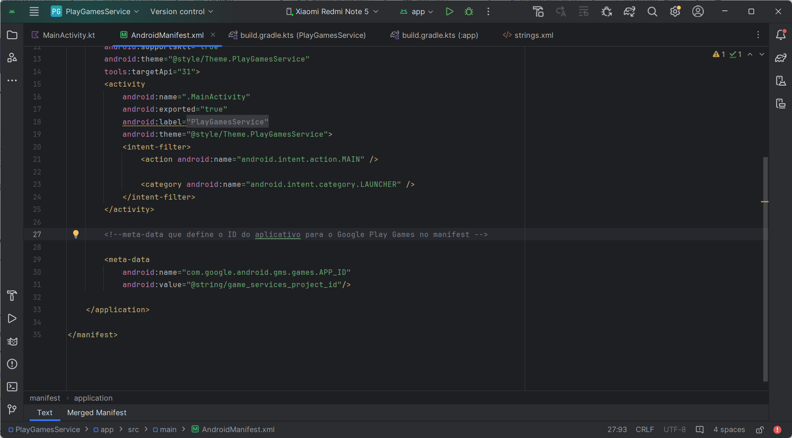
    - Descrição da Imagem 14: Nesta imagem, é mostrado ...
