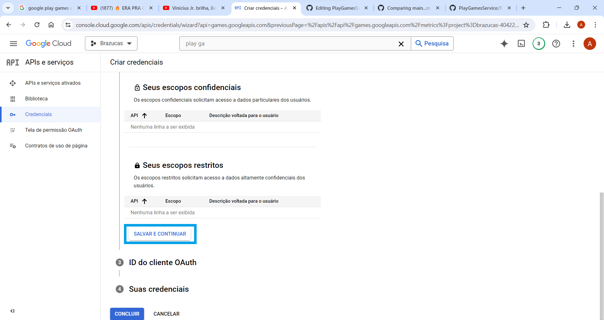

# PlayGamesService

Este é um tutorial de como implementar o Google Play Games Service em um projeto!:
# Tutorial de Implementação do Google Play Games Service

Este é um tutorial passo a passo sobre como implementar o Google Play Games Service em seu projeto.

## Pré-requisitos

Antes de começar, certifique-se de ter:

- Uma conta no Google Cloud Platform (GCP)
- Seu projeto configurado no GCP

## Passos

Siga os passos abaixo para implementar o Google Play Games Service em seu projeto:

1. **Criar um Projeto no Google Cloud Platform (GCP)**:
   - Acesse o Console do GCP em [https://console.cloud.google.com/](https://console.cloud.google.com/) e crie um projeto

2. **Clique em  APIS e serviços**:

3. **Na opção de pesquisa, pesquise por Play Games ou Google Play Games Service e selecione a opção Google Play Games Service**:

4. **Ao chegar na pagina detalhes da API do Google Play Games Service, ative-a**:

5. **Após ativa-la clike em criar as credenciais do Google Play Games Services**:

6. **Na tela de criar as credenciasi selecione a API do Google Play Games Services e escolha entre dados do usuario ou dados do aplicativo (atualmente eu selecionei a opção dados do usuario) e clike em PROXIMA**:

7. **Na tela dos escorpos eu não inseri nenhum escopo neste projeto e é opcional adicionarr algum escorpo, clike em SALVAR E CONTINUAR**:
 

8. **Na tela dos escorpos eu não inseri nenhum escopo neste projeto e é opcional adicionarr algum escorpo, clike em SALVAR E CONTINUAR**:

9. **Ap**:

10.

11.

12.

13.

14.

